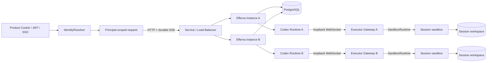

# 架构与一致性语义

## 组件边界

App 实例包含无状态 HTTP 层、Run worker、沙盒外 Codex Runtime 与 Executor Gateway。
Gateway 把 Codex 远程执行协议转换为统一 `SandboxRuntime`，再由 OpenSandbox execd API
或第三方 Provider 执行。PostgreSQL 是控制面真相来源；工作区只挂载给 Session sandbox，
不挂载给 Web/App 实例。

## 产品身份与三层资源

| 概念 | 作用 | 持久化位置 |
|---|---|---|
| Principal | 当前产品用户、活动租户与即时能力 | 不持久化，由产品逐请求解析 |
| Session | 用户所有权、产品工作区与调度边界 | `app_sessions` |
| Thread | 同一工作区中的独立多轮对话 | `app_threads` + `codex_engine.threads` |
| Run | Thread 上的一次用户输入与执行 | `runs` + `run_events` + `messages` |

Principal 使用 `tenant_id + issuer + subject` 形成身份边界。Efferva 不复制产品用户表或角色
表；产品把现有角色即时映射为框架 Capability。Session 保存租户和所有者，Thread、Run、
Message 与 Event 均通过 Session 继承权限。

一个 Session 的多个 Thread 共用一个由 OpenSandbox 管理的持久工作区。多个 Thread
可以同时执行；同一 Thread 同一时刻只允许一个 Run 执行，避免 Codex 对话历史发生分叉写入。

## 授权边界

HTTP 层不能直接获取系统 Repository。每次已认证请求只能创建绑定 Principal 的
`AuthorizedRepository`，其每个 Session、Thread、Run 和 Event 查询都带租户/所有者作用域。
Worker 与沙盒控制器使用独立 `SystemRepository`，其中的实例 `owner_id` 只表示执行租约，
不是终端用户身份。

普通用户只有隐式 owner 权限。`SESSIONS_READ_TENANT` 与 `SESSIONS_WRITE_TENANT` 分别扩大
当前租户内的读、写作用域，永远不能跨租户。无权限的直接资源访问返回 `404`，防止利用响应
差异枚举资源；显式请求无权使用的 `scope=tenant` 返回 `403`。

## 为什么浏览器不需要粘性 Session

Run 在创建后由数据库队列驱动，与发起请求的 HTTP 连接解耦。每个 AG-UI 事件先提交到
`run_events(run_id, seq)`，再由任意 App 实例读取并输出 SSE。

浏览器断开只关闭当前 SSE reader，不会向 worker 发送取消。重连有两种方式：

1. AG-UI 客户端使用相同 `runId` 并发送 `Last-Event-ID`；
2. 内置 WebUI 重新读取 Thread，发现最近的 `queued/running` Run，然后建立 EventSource。

SSE 本身也使用同一个 AuthorizedRepository，因此补流不会绕开用户边界。负载均衡器可把
每次重连发到任意实例。

## 多实例执行租约

浏览器流量无粘性，但执行必须有单写者：

- `session_leases` 使一个 Session 在任一时刻归一个 App Runtime 管理；
- `fencing_epoch` 防止过期实例继续写 Run 事件；
- Codex PostgreSQL ThreadStore 另有 writer lease，防止同一 Codex Thread 双写；
- `FOR UPDATE SKIP LOCKED` 让多个实例竞争队列时只领取一次。

租约默认 30 秒、每 10 秒续约。同一 owner 可领取该 Session 的多个不同 Thread，所以共享
工作区并行成立；其他实例仍可服务这个 Session 的读取与 SSE。最后一个并行 Run 结束后，
Runtime 会 unsubscribe 并卸载 Codex Thread，再原子地释放空闲 Session 租约，因此下一次
Run 可由任意实例领取。

实例崩溃后，Run 会在租约过期后重新入队，并由其他实例从 PostgreSQL 恢复 Codex Thread。
MVP 的崩溃恢复语义是 **at-least-once**：如果旧实例在崩溃前已经对外部系统产生不可逆副作用，
重放 prompt 可能重复该副作用。浏览器断线不触发重放，因此正常断线补流没有这个问题。生产版
需要为有副作用的 Tool 增加幂等键或提交日志。

## PostgreSQL 与工作区存储的职责

PostgreSQL 保存可查询、可补流、可跨实例恢复的结构化状态。OpenSandbox 的持久卷只保存
用户工作区文件。App 实例不挂载用户工作区；每个 Session 的工作区只由对应 sandbox 使用。

`workspace_bindings` 与 `sandbox_leases` 只保存 Provider 名称、不透明 `external_ref/state_json`
和 fencing 状态，不保存假设某种沙盒拓扑的 endpoint。Thread、Run 与 Event 仍通过 Session
继承身份边界，不重复存租户字段。

具体使用 Docker named volume、Kubernetes PVC 或厂商存储由 OpenSandbox 部署决定，不进入
Efferva 的 Provider 状态模型。

## Sandbox 信任边界

Codex Runtime 和 API key 留在 App 容器/Pod；sandbox 不接收 API key，App 也不需要 Docker
Socket 或 Kubernetes 凭据。Executor Gateway 位于 App 实例中，仅监听 loopback，并在每个
协议请求上验证 Sandbox lease fencing。沙箱创建、命令执行和文件访问统一通过 OpenSandbox
Server；Docker Socket 或 Kubernetes 凭据只属于 OpenSandbox 自己的部署边界。
